<div align="center">
  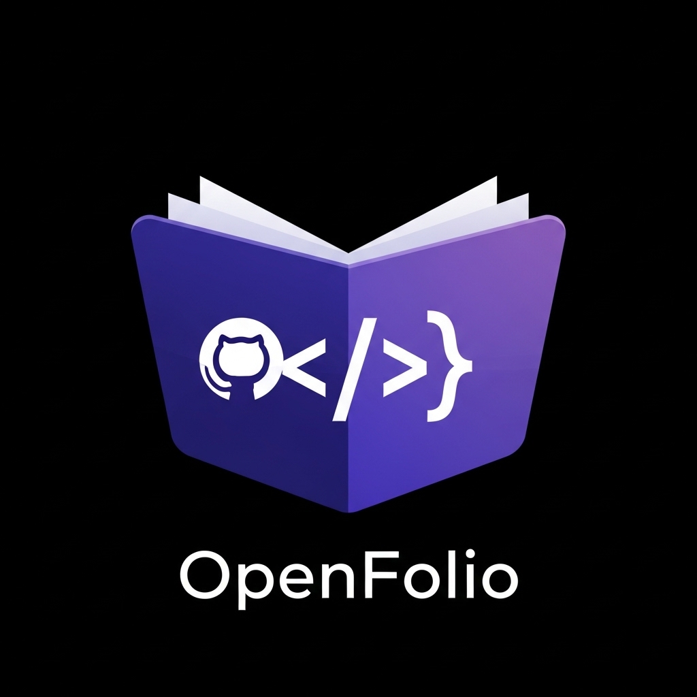

  # OpenFolio

  > **Full-stack developer portfolio platform** — GitHub-powered portfolios, AI-enhanced resumes, and PDF export.
  > Built with Spring Boot 3 · React Native · MySQL · Ollama AI.
</div>

---

<div align="center">

### 📱 App Showcase

<table>
  <tr>
    <td align="center" width="33%">
      <br />
      <strong>GitHub Login & Import</strong><br />
      <sub>One-tap OAuth → auto-import repos</sub>
    </td>
    <td align="center" width="33%">
      <br />
      <strong>Portfolio Preview</strong><br />
      <sub>Live HTML preview of your portfolio</sub>
    </td>
    <td align="center" width="33%">
      <br />
      <strong>Theme Switching</strong><br />
      <sub>Dark · Clean · Hacker · Minimal</sub>
    </td>
  </tr>
  <tr>
    <td align="center" width="33%">
      <br />
      <strong>Resume Builder</strong><br />
      <sub>Skills, projects & experience editor</sub>
    </td>
    <td align="center" width="33%">
      <br />
      <strong>PDF Export</strong><br />
      <sub>Generate & save professional PDFs</sub>
    </td>
    <td align="center" width="33%">
      <br />
      <strong>PDF Preview</strong><br />
      <sub>In-app PDF viewer with templates</sub>
    </td>
  </tr>
  <tr>
    <td align="center" width="33%">
      <br />
      <strong>Publish Tab</strong><br />
      <sub>Manage public portfolio & resume links</sub>
    </td>
    <td align="center" width="33%">
      <br />
      <strong>Publish & Share</strong><br />
      <sub>One-tap publish → shareable URL</sub>
    </td>
    <td align="center" width="33%">
      <br />
    </td>
  </tr>
</table>

</div>

---

## Table of Contents

1. [Overview](#1-overview)
2. [System Architecture](#2-system-architecture)
3. [Technology Stack](#3-technology-stack)
4. [Repository Structure](#4-repository-structure)
5. [Backend — Spring Boot API](#5-backend--spring-boot-api)
   - 5.1 [Package Structure](#51-package-structure)
   - 5.2 [Domain Model](#52-domain-model)
   - 5.3 [Layer Architecture](#53-layer-architecture)
   - 5.4 [Security & Authentication](#54-security--authentication)
   - 5.5 [REST API Reference](#55-rest-api-reference)
   - 5.6 [Database Schema](#56-database-schema)
   - 5.7 [Flyway Migrations](#57-flyway-migrations)
6. [GitHub Ingestion Pipeline](#6-github-ingestion-pipeline)
7. [AI Enhancement Engine](#7-ai-enhancement-engine)
8. [PDF Export Pipeline](#8-pdf-export-pipeline)
9. [Portfolio & Resume Lifecycle](#9-portfolio--resume-lifecycle)
10. [Mobile App — React Native](#10-mobile-app--react-native)
    - 10.1 [Screen Navigation](#101-screen-navigation)
    - 10.2 [State Management](#102-state-management)
    - 10.3 [API Client & Token Refresh](#103-api-client--token-refresh)
    - 10.4 [Theme System](#104-theme-system)
11. [Public Portfolio Publishing](#11-public-portfolio-publishing)
12. [Developer Setup](#12-developer-setup)
    - 12.1 [Backend](#121-backend)
    - 12.2 [Mobile](#122-mobile)
    - 12.3 [Ollama AI (Local)](#123-ollama-ai-local)
13. [Environment Variables](#13-environment-variables)
14. [Diagram Gallery](#14-diagram-gallery)

---

## 1. Overview

OpenFolio is a mobile-first developer portfolio platform that turns a GitHub account into a polished, shareable portfolio in seconds. It ingests your GitHub profile, repositories, and README, then uses a locally-hosted large language model (Ollama + `qwen2.5:14b`) to rewrite raw repo descriptions into professional resume bullet points. The final output can be exported as a PDF resume using one of several professionally designed templates.

**Core user journey:**

```
Sign in with GitHub  →  Auto-import portfolio  →  Edit & curate  →
AI-enhance descriptions  →  Export PDF resume  →  Publish & share
```

**Key capabilities:**

| Feature | Details |
|---|---|
| GitHub OAuth login | Authorization-code flow; profile + repos imported automatically |
| LinkedIn OAuth login | Profile data import for experience/education |
| GitHub ingestion | Repos, languages, profile README, star counts, top-language aggregation |
| AI rewriting | Local Ollama (`qwen2.5:14b`) rewrites descriptions; cached in DB |
| PDF export | 4 portfolio themes × 4 resume templates via `openhtmltopdf` |
| Public sharing | Slug-based public portfolio pages + token-based public PDF links |
| Resume builder | Separate resume entity with manual experience/education/certifications |
| Saved resumes | Persistent PDF storage in DB (LONGBLOB) with publish tokens |

---

## 2. System Architecture

The platform follows a classic **3-tier architecture**: a React Native mobile client, a Spring Boot REST API, and a MySQL database. An external Ollama service runs locally (or on the same host) for AI text generation.

```
┌─────────────────────────────────────────────────────────────────┐
│                     REACT NATIVE MOBILE APP                     │
│  Zustand State  ·  Axios + JWT  ·  React Navigation 7           │
└─────────────────────────┬───────────────────────────────────────┘
                          │  HTTPS / REST  (Bearer JWT)
┌─────────────────────────▼───────────────────────────────────────┐
│                  SPRING BOOT 3.4.2  (Java 21)                   │
│                                                                 │
│  ┌─────────┐  ┌──────────┐  ┌───────────┐  ┌───────────────┐  │
│  │  Auth   │  │Portfolio │  │  Export   │  │  Ingestion    │  │
│  │ Service │  │ Service  │  │  Service  │  │  Service      │  │
│  └────┬────┘  └────┬─────┘  └─────┬─────┘  └──────┬────────┘  │
│       │            │              │                │            │
│  ┌────▼────────────▼──────────────▼────────────────▼────────┐  │
│  │                  JPA Repositories (Spring Data)           │  │
│  └─────────────────────────┬─────────────────────────────────┘  │
└────────────────────────────┼────────────────────────────────────┘
                             │  JDBC / Hibernate
┌────────────────────────────▼────────────────────────────────────┐
│                   MYSQL 8  (Flyway-managed schema)              │
│  17 migrations · 12 tables · utf8mb4                           │
└─────────────────────────────────────────────────────────────────┘

External services:
  GitHub API  ──►  Ingestion Service  (REST, GITHUB_TOKEN)
  Ollama      ──►  AI Enhancer        (localhost:11434, qwen2.5:14b)
```

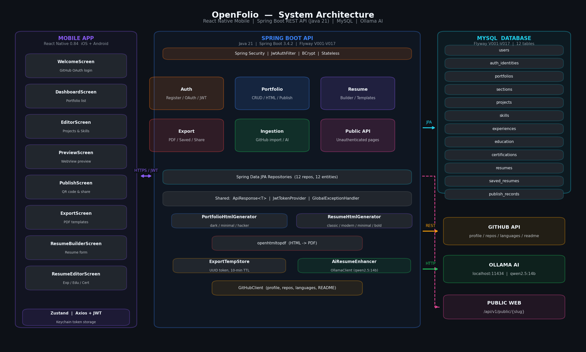

---

## 3. Technology Stack

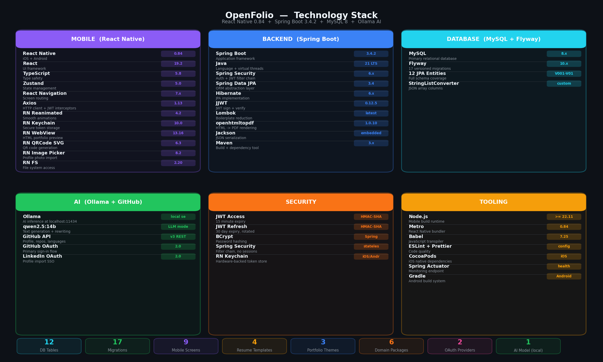

### Backend

| Component | Technology | Version |
|---|---|---|
| Runtime | Java | 21 |
| Framework | Spring Boot | 3.4.2 |
| Web | Spring Web MVC | — |
| Persistence | Spring Data JPA + Hibernate | — |
| Database | MySQL | 8.x |
| Migrations | Flyway | — |
| Security | Spring Security | — |
| JWT | jjwt | 0.12.5 |
| PDF rendering | openhtmltopdf-pdfbox | 1.0.10 |
| Code generation | Lombok | — |
| Monitoring | Spring Boot Actuator | — |
| Build tool | Maven | 3.x |

### Mobile

| Component | Technology | Version |
|---|---|---|
| Framework | React Native | 0.84.0 |
| Language | TypeScript | 5.8.3 |
| React | React | 19.2.3 |
| State management | Zustand | 5.0.11 |
| HTTP client | Axios | 1.13.5 |
| Navigation | React Navigation | 7.x |
| Secure storage | react-native-keychain | 10.0.0 |
| PDF viewer | react-native-webview | 13.16.0 |
| QR codes | react-native-qrcode-svg | 6.3.21 |
| Animations | react-native-reanimated | 4.2.2 |
| File system | react-native-fs | 2.20.0 |
| Image picker | react-native-image-picker | 8.2.1 |
| Drag & drop | react-native-draggable-flatlist | 4.0.3 |

### AI / External

| Component | Technology |
|---|---|
| LLM runtime | Ollama |
| Model | `qwen2.5:14b` |
| GitHub import | GitHub REST API v3 |
| LinkedIn import | LinkedIn OAuth 2.0 API |

---

## 4. Repository Structure

```
OpenFolio/
├── backend/                        # Spring Boot API
│   ├── pom.xml
│   └── src/main/
│       ├── java/com/openfolio/
│       │   ├── OpenFolioApplication.java
│       │   ├── auth/               # Authentication domain
│       │   │   ├── AuthController.java
│       │   │   ├── AuthService.java
│       │   │   ├── AuthIdentity.java
│       │   │   ├── AppUserDetailsService.java
│       │   │   └── oauth/
│       │   │       ├── OAuthProvider.java          # interface
│       │   │       ├── GitHubOAuthProvider.java
│       │   │       └── LinkedInOAuthProvider.java
│       │   ├── user/               # User domain
│       │   │   ├── User.java
│       │   │   ├── UserRepository.java
│       │   │   ├── UserService.java
│       │   │   └── UserController.java
│       │   ├── portfolio/          # Portfolio domain
│       │   │   ├── Portfolio.java
│       │   │   ├── PortfolioRepository.java
│       │   │   ├── PortfolioService.java
│       │   │   ├── PortfolioController.java
│       │   │   ├── PortfolioItemsController.java
│       │   │   ├── PortfolioBundle.java            # value record
│       │   │   ├── PortfolioDataLoader.java
│       │   │   └── PortfolioHtmlGenerator.java
│       │   ├── resume/             # Resume builder domain
│       │   │   ├── Resume.java
│       │   │   ├── ResumeService.java
│       │   │   ├── ResumeController.java
│       │   │   ├── ResumeItemsController.java
│       │   │   ├── ResumeBundle.java
│       │   │   └── ResumeHtmlGenerator.java
│       │   ├── section/            # Portfolio sections
│       │   ├── project/            # GitHub projects
│       │   ├── skill/              # Skills
│       │   ├── experience/         # Work experience
│       │   ├── education/          # Education records
│       │   ├── certification/      # Certifications
│       │   ├── export/             # PDF export
│       │   │   ├── ExportController.java
│       │   │   ├── ExportService.java
│       │   │   ├── ExportTempStore.java
│       │   │   ├── SavedResume.java
│       │   │   └── SavedResumeRepository.java
│       │   ├── ingestion/          # GitHub import pipeline
│       │   │   ├── IngestionService.java
│       │   │   └── GitHubClient.java
│       │   ├── publish/            # Public portfolio publishing
│       │   │   ├── PublishService.java
│       │   │   └── PublishRecord.java
│       │   ├── publicapi/          # Public (unauthenticated) endpoints
│       │   │   └── PublicPortfolioController.java
│       │   ├── ai/                 # AI enhancement
│       │   │   ├── AiResumeEnhancer.java
│       │   │   └── OllamaClient.java
│       │   └── shared/             # Cross-cutting concerns
│       │       ├── security/
│       │       │   ├── SecurityConfig.java
│       │       │   ├── JwtTokenProvider.java
│       │       │   ├── JwtAuthFilter.java
│       │       │   └── AuthenticatedUser.java
│       │       ├── web/
│       │       │   ├── ApiResponse.java
│       │       │   └── GlobalExceptionHandler.java
│       │       └── exception/
│       │           └── ResourceNotFoundException.java
│       └── resources/
│           ├── application.yml
│           ├── templates/          # Thymeleaf HTML templates
│           └── db/migration/       # Flyway SQL migrations V001–V017
├── mobile/                         # React Native app
│   ├── package.json
│   ├── tsconfig.json
│   └── src/
│       ├── api/
│       │   ├── apiClient.ts        # Axios instance + JWT interceptors
│       │   └── endpoints.ts        # Typed endpoint constants
│       ├── features/
│       │   ├── auth/
│       │   │   ├── screens/WelcomeScreen.tsx
│       │   │   ├── store/authStore.ts
│       │   │   └── services/authService.ts
│       │   ├── dashboard/
│       │   │   ├── screens/DashboardScreen.tsx
│       │   │   └── store/portfolioStore.ts
│       │   ├── editor/
│       │   │   └── screens/EditorScreen.tsx
│       │   ├── preview/
│       │   │   └── screens/PreviewScreen.tsx
│       │   ├── publish/
│       │   │   └── screens/PublishScreen.tsx
│       │   ├── export/
│       │   │   └── screens/ExportScreen.tsx
│       │   └── resume/
│       │       ├── screens/ResumeBuilderScreen.tsx
│       │       ├── screens/ResumeEditorScreen.tsx
│       │       ├── screens/ResumeTemplatesScreen.tsx
│       │       └── screens/ResumePreviewScreen.tsx
│       ├── navigation/
│       │   ├── RootNavigator.tsx
│       │   └── AppNavigator.tsx
│       └── theme/
│           ├── index.ts
│           ├── tokens.ts
│           └── ThemeProvider.tsx
├── diagrams/                       # Architecture diagrams + generator
│   ├── generate_diagrams.py
│   ├── 01_system_architecture.png
│   ├── 02_erd.png
│   ├── 03_backend_layers.png
│   ├── 04_api_endpoints.png
│   ├── 05_mobile_navigation.png
│   ├── 06_auth_flow.png
│   ├── 07_ingestion_pipeline.png
│   ├── 08_pdf_export_flow.png
│   ├── 09_portfolio_lifecycle.png
│   └── 10_tech_stack.png
└── venv/                           # Python venv for diagram generation
```

---

## 5. Backend — Spring Boot API

### 5.1 Package Structure

The backend uses a **domain-driven package structure** — each business concept lives in its own top-level package alongside its controller, service, repository, and entity. This makes the codebase navigable by feature rather than by technical role.

```
com.openfolio
├── auth          — registration, login, OAuth, JWT issuance
├── user          — user profile CRUD
├── portfolio     — portfolio CRUD, HTML generation, section reordering
├── resume        — resume builder (separate from portfolio)
├── section       — portfolio section management
├── project       — GitHub repository entities
├── skill         — skill entities (imported + manual)
├── experience    — work experience records
├── education     — education records
├── certification — certifications
├── export        — PDF generation, temp store, saved resumes
├── ingestion     — GitHub import pipeline
├── publish       — public portfolio publishing
├── publicapi     — unauthenticated public endpoints
├── ai            — Ollama client + AI enhancer
└── shared        — security, JWT, web utilities, exception handling
```

### 5.2 Domain Model

Each domain entity is a JPA `@Entity` mapped to a MySQL table. Key entities and their relationships:

```
User (1) ────────────── (*) AuthIdentity
  │                         (GitHub / LinkedIn credentials)
  │
  ├── (*) Portfolio
  │     ├── (*) Section         (ordered display sections)
  │     ├── (*) Project         (GitHub repos)
  │     ├── (*) Skill           (languages & tools)
  │     ├── (*) Experience      (work history)
  │     ├── (*) Education       (education records)
  │     ├── (*) Certification
  │     └── (1) PublishRecord   (public slug data)
  │
  ├── (*) Resume
  │     ├── (*) ResumeExperience
  │     ├── (*) ResumeEducation
  │     └── (*) ResumeCertification
  │
  └── (*) SavedResume           (persistent PDF + publish token)
```

**Notable design patterns:**

- **`PortfolioBundle`** and **`ResumeBundle`**: Java 21 record types that aggregate all data needed for HTML/PDF rendering into a single immutable value object. Services load them once and pass them through the rendering pipeline.
- **`StringListConverter`**: JPA `AttributeConverter` that serializes `List<String>` (e.g., `Project.languages`) as a JSON array column in MySQL.
- **`@CreationTimestamp` / `@UpdateTimestamp`**: Hibernate annotations for automatic audit timestamps on all entities.
- **AI caching columns**: `ai_enhanced_description` and `ai_enhanced_at` on `Project`; `ai_enhanced_summary` on `Portfolio`. AI calls are cached in the DB so they survive server restarts.

### 5.3 Layer Architecture

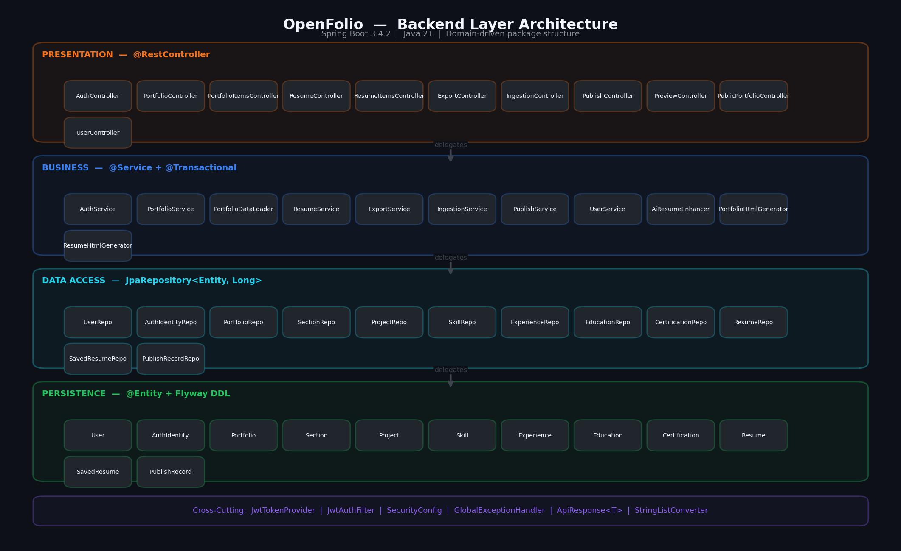

The backend follows a strict 4-layer architecture:

```
HTTP Request
     │
     ▼
┌─────────────────────────────────────────┐
│  CONTROLLER LAYER (@RestController)     │
│  · Maps HTTP verbs + paths              │
│  · Validates @RequestParam / @PathVar   │
│  · Resolves @AuthenticationPrincipal    │
│  · Returns ResponseEntity<ApiResponse<T>>│
└──────────────────┬──────────────────────┘
                   │
┌──────────────────▼──────────────────────┐
│  SERVICE LAYER (@Service)               │
│  · Owns business logic                  │
│  · @Transactional boundaries            │
│  · Orchestrates between repositories   │
│  · Throws ResourceNotFoundException    │
└──────────────────┬──────────────────────┘
                   │
┌──────────────────▼──────────────────────┐
│  REPOSITORY LAYER (JpaRepository<T,ID>) │
│  · Spring Data derived queries          │
│  · Custom @Query JPQL where needed      │
│  · Zero implementation code             │
└──────────────────┬──────────────────────┘
                   │
┌──────────────────▼──────────────────────┐
│  ENTITY LAYER (@Entity)                 │
│  · JPA-mapped POJO with Lombok          │
│  · Flyway-managed DDL                   │
│  · No business logic — pure data model  │
└─────────────────────────────────────────┘
```

**Universal response wrapper:**

Every authenticated API endpoint returns:

```json
{
  "data": { ... },
  "error": null,
  "meta": { "timestamp": "2025-01-01T12:00:00" }
}
```

The `ApiResponse<T>` generic type is constructed via factory methods `ApiResponse.ok(data)` and `ApiResponse.error(message)`. `GlobalExceptionHandler` maps `ResourceNotFoundException` → `404` and validation errors → `400` automatically.

### 5.4 Security & Authentication

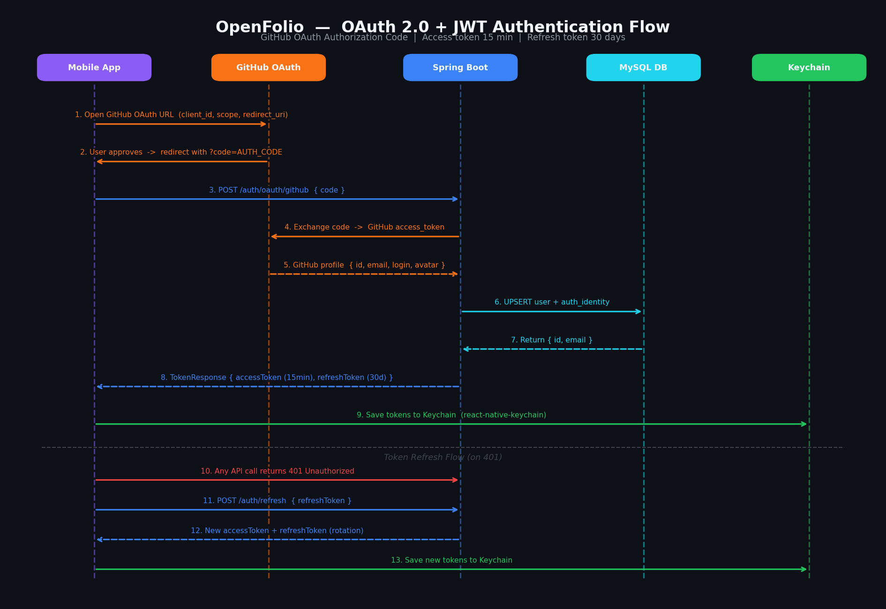

#### Authentication Modes

The platform supports three authentication modes:

| Mode | Flow | Endpoint |
|---|---|---|
| Email + password | Register → login → JWT | `POST /api/v1/auth/register` / `login` |
| GitHub OAuth | Authorization code → `AuthService.handleOAuth()` | `GET /api/v1/auth/oauth/github` |
| LinkedIn OAuth | Authorization code → `AuthService.handleOAuth()` | `GET /api/v1/auth/oauth/linkedin` |

#### JWT Token Lifecycle

```
Login / OAuth callback
        │
        ▼
AuthService.issueTokens(userId)
        │
        ├── accessToken  (15 min · HMAC-SHA · jjwt 0.12.5)
        └── refreshToken (30 days · stored in AuthIdentity.refreshToken)

HTTP Request
        │
        ▼
JwtAuthFilter (OncePerRequestFilter)
        │
        ├── Extract "Bearer <token>" from Authorization header
        ├── Validate signature + expiry via JwtTokenProvider
        ├── Load user via AppUserDetailsService
        └── Set SecurityContextHolder

Token Refresh
        │
        ▼
POST /api/v1/auth/refresh  { refreshToken }
        │
        ├── Validate refresh token in DB (AuthIdentity table)
        ├── Issue new access + refresh token pair
        └── Invalidate old refresh token (rotation)
```

#### OAuth Provider Abstraction

The `OAuthProvider` interface enables clean polymorphism:

```java
public interface OAuthProvider {
    String providerName();                         // "github" | "linkedin"
    OAuthUserInfo exchangeCode(String code);       // code → user profile
}
```

Spring injects a `Map<String, OAuthProvider>` keyed by `providerName()` into `AuthService`. The controller calls `handleOAuth(providerName, code)` generically — adding a new provider requires only a new `@Component` implementation of the interface.

#### Security Configuration

```
Permitted (no JWT required):
  /api/v1/auth/**
  /api/v1/public/**
  /api/v1/export/download/{token}
  /actuator/health

All other routes: require valid JWT
  → 401 Unauthorized if missing/invalid
  → 403 Forbidden if valid but wrong user's resource
```

### 5.5 REST API Reference

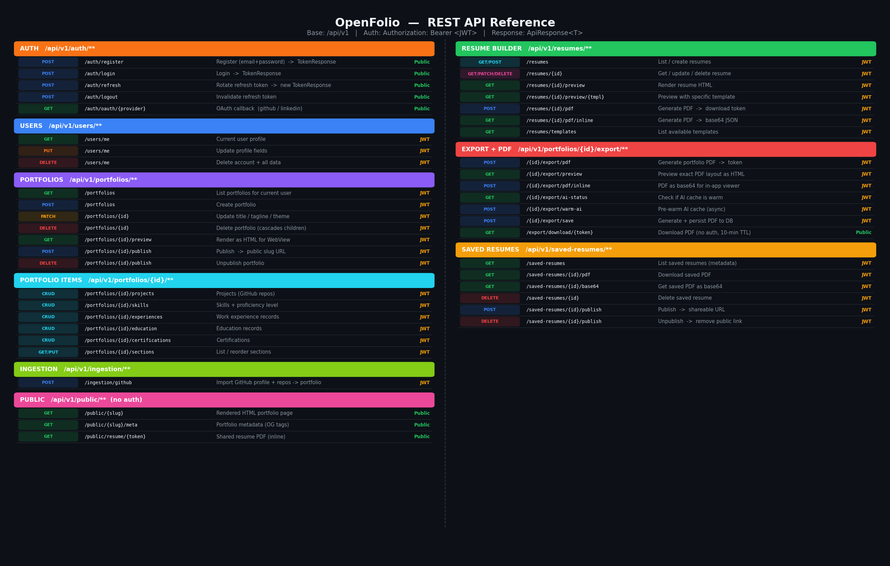

#### Authentication — `/api/v1/auth`

| Method | Path | Description |
|---|---|---|
| `POST` | `/auth/register` | Email/password registration |
| `POST` | `/auth/login` | Email/password login → JWT pair |
| `POST` | `/auth/refresh` | Rotate refresh token → new JWT pair |
| `POST` | `/auth/logout` | Invalidate refresh token |
| `GET` | `/auth/oauth/github` | GitHub OAuth callback handler |
| `GET` | `/auth/oauth/linkedin` | LinkedIn OAuth callback handler |

#### Users — `/api/v1/users`

| Method | Path | Description |
|---|---|---|
| `GET` | `/users/me` | Current user profile |
| `PUT` | `/users/me` | Update display name / avatar |

#### Portfolios — `/api/v1/portfolios`

| Method | Path | Description |
|---|---|---|
| `GET` | `/portfolios` | List all portfolios for current user |
| `POST` | `/portfolios` | Create portfolio |
| `GET` | `/portfolios/{id}` | Get portfolio by ID |
| `PUT` | `/portfolios/{id}` | Update portfolio metadata |
| `DELETE` | `/portfolios/{id}` | Delete portfolio |
| `GET` | `/portfolios/{id}/preview` | HTML preview (browser-renderable) |
| `POST` | `/portfolios/{id}/publish` | Publish portfolio (assign public slug) |
| `GET` | `/portfolios/{id}/publish/status` | Publication status |

#### Portfolio Items — `/api/v1/portfolios/{id}`

| Method | Path | Description |
|---|---|---|
| `GET/POST` | `/{id}/projects` | List / add projects |
| `PUT/DELETE` | `/{id}/projects/{pid}` | Update / remove project |
| `GET/POST` | `/{id}/skills` | List / add skills |
| `PUT/DELETE` | `/{id}/skills/{sid}` | Update / remove skill |
| `GET/POST` | `/{id}/experiences` | List / add experiences |
| `PUT/DELETE` | `/{id}/experiences/{eid}` | Update / remove experience |
| `GET/POST` | `/{id}/education` | List / add education |
| `PUT/DELETE` | `/{id}/education/{eid}` | Update / remove education |
| `GET/POST` | `/{id}/certifications` | List / add certifications |
| `PUT/DELETE` | `/{id}/certifications/{cid}` | Update / remove certification |
| `GET` | `/{id}/sections` | List sections with display order |
| `PUT` | `/{id}/sections/reorder` | Reorder sections |

#### Export — `/api/v1/portfolios/{id}/export`

| Method | Path | Description |
|---|---|---|
| `POST` | `/export/pdf` | Generate PDF → short-lived download token |
| `GET` | `/export/preview` | Return HTML preview matching PDF layout |
| `POST` | `/export/pdf/inline` | Generate PDF → base64-encoded JSON |
| `GET` | `/export/ai-status` | Check if AI cache is warm |
| `POST` | `/export/warm-ai` | Trigger async AI cache warm-up |
| `POST` | `/export/save` | Generate PDF and persist to DB |

#### Saved Resumes — `/api/v1/saved-resumes`

| Method | Path | Description |
|---|---|---|
| `GET` | `/saved-resumes` | List saved resumes (metadata only) |
| `GET` | `/saved-resumes/{id}/pdf` | Download PDF |
| `GET` | `/saved-resumes/{id}/base64` | Get PDF as base64 JSON |
| `DELETE` | `/saved-resumes/{id}` | Delete saved resume |
| `POST` | `/saved-resumes/{id}/publish` | Create shareable public URL |
| `DELETE` | `/saved-resumes/{id}/publish` | Remove public URL |

#### Resume Builder — `/api/v1/resumes`

| Method | Path | Description |
|---|---|---|
| `GET` | `/resumes` | List resumes for current user |
| `POST` | `/resumes` | Create resume |
| `GET/PUT/DELETE` | `/resumes/{id}` | CRUD operations |
| `GET` | `/resumes/{id}/preview` | HTML preview |
| `GET` | `/resumes/{id}/pdf/inline` | PDF as base64 |
| `GET` | `/resumes/templates` | List available templates |

#### Public — `/api/v1/public` (no auth)

| Method | Path | Description |
|---|---|---|
| `GET` | `/public/{slug}` | Public portfolio page |
| `GET` | `/public/{slug}/meta` | Portfolio metadata (OG tags) |
| `GET` | `/public/resume/{token}` | Public shared PDF (inline) |
| `GET` | `/export/download/{token}` | One-time PDF download |

#### Ingestion — `/api/v1/ingestion`

| Method | Path | Description |
|---|---|---|
| `POST` | `/ingestion/github` | Trigger GitHub import |
| `POST` | `/ingestion/linkedin` | Trigger LinkedIn import |

### 5.6 Database Schema

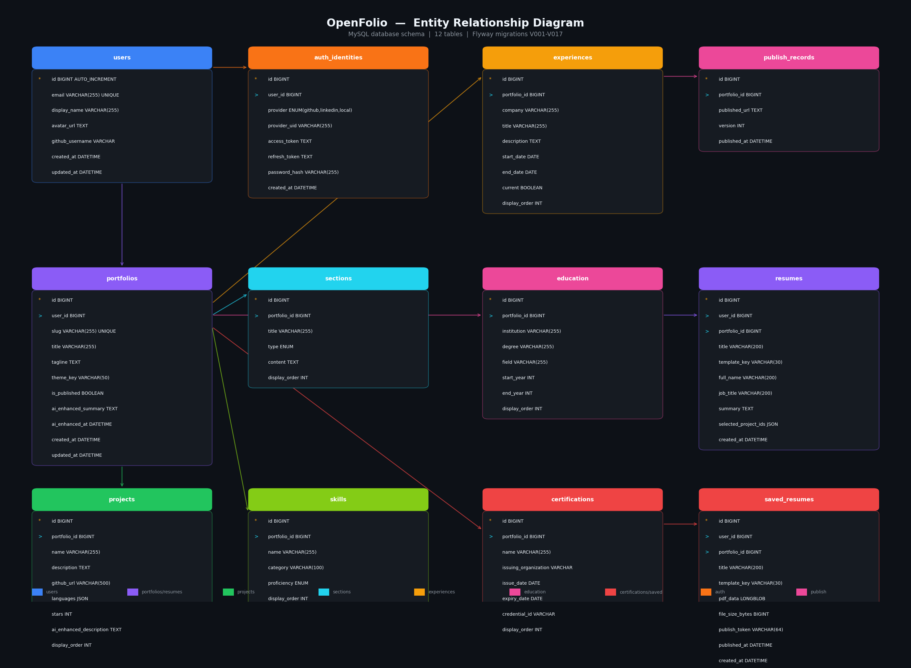

#### Table Overview

| Table | Primary Key | Foreign Keys | Notes |
|---|---|---|---|
| `users` | `id` | — | Core user record; email unique |
| `auth_identities` | `id` | `user_id → users` | OAuth tokens + refresh tokens |
| `portfolios` | `id` | `user_id → users` | Slug unique; theme_key, is_published |
| `sections` | `id` | `portfolio_id → portfolios` | Display order, type enum |
| `projects` | `id` | `portfolio_id → portfolios` | Languages stored as JSON array |
| `skills` | `id` | `portfolio_id → portfolios` | Category + proficiency level |
| `experiences` | `id` | `portfolio_id → portfolios` | Work history |
| `education` | `id` | `portfolio_id → portfolios` | Degree nullable (V016) |
| `certifications` | `id` | `portfolio_id → portfolios` | Added in V015 |
| `resumes` | `id` | `user_id → users` | Independent resume builder |
| `publish_records` | `id` | `portfolio_id → portfolios` | Published slug metadata |
| `saved_resumes` | `id` | `user_id, portfolio_id → users/portfolios` | LONGBLOB PDF + publish_token |

All tables use `ENGINE=InnoDB`, `utf8mb4` charset, and `ON DELETE CASCADE` for child records.

#### Key Column Details

**`projects`** — AI caching:
```sql
description          TEXT,
ai_enhanced_description TEXT,
ai_enhanced_at       DATETIME,
languages            JSON,          -- ["TypeScript","Java","Python"]
stars                INT,
github_url           VARCHAR(500)
```

**`portfolios`** — AI caching:
```sql
ai_enhanced_summary  TEXT,
ai_enhanced_at       DATETIME,
theme_key            VARCHAR(100) DEFAULT 'light',
is_published         BOOLEAN DEFAULT FALSE
```

**`auth_identities`** — tokens:
```sql
provider             VARCHAR(50),   -- 'github' | 'linkedin' | 'local'
provider_user_id     VARCHAR(255),
access_token         TEXT,
refresh_token        TEXT,          -- hashed long-lived token
password_hash        VARCHAR(255)   -- BCrypt, only for 'local' provider
```

**`saved_resumes`** — persistent PDFs:
```sql
pdf_data             LONGBLOB,
file_size_bytes      BIGINT,
template_key         VARCHAR(50),
publish_token        VARCHAR(64),   -- UUID without dashes; null = private
published_at         DATETIME
```

### 5.7 Flyway Migrations

Migrations run automatically on startup. Each migration is additive and never destructive (no DROP TABLE or ALTER COLUMN that loses data).

| Migration | Change |
|---|---|
| V001 | Create `users` table |
| V002 | Create `auth_identities` table |
| V003 | Create `portfolios` table |
| V004 | Create `sections` table |
| V005 | Create `projects` table |
| V006 | Create `skills` table |
| V007 | Create `experiences` table |
| V008 | Create `education` table |
| V009 | Create `publish_records` table |
| V010 | Create `resume_exports` table |
| V011 | Schema enhancements (indexes, nullable fixes) |
| V012 | Create `resumes` table (resume builder) |
| V013 | Add AI cache columns to `projects` + `portfolios` |
| V014 | Create `saved_resumes` table (LONGBLOB PDF storage) |
| V015 | Create `certifications` table |
| V016 | Make `education.degree` nullable |
| V017 | Add `publish_token` / `published_at` to `saved_resumes` |

---

## 6. GitHub Ingestion Pipeline

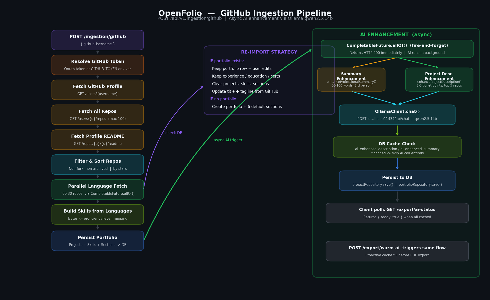

The ingestion pipeline is the flagship feature — it turns a GitHub account into a fully structured developer portfolio in a single API call.

### Pipeline Stages

```
POST /api/v1/ingestion/github
        │
        ▼
1. Fetch GitHub user profile
   → displayName, avatarUrl, bio, githubUsername
        │
        ▼
2. Fetch public repositories (up to 100, sorted by updated)
   → name, description, stargazerCount, primaryLanguage, url
        │
        ▼
3. Fetch profile README (github.com/{username}/{username})
   → Used as professional summary / about section
        │
        ▼
4. Aggregate top languages (parallel, top 30 repos)
   ┌─────────────────────────────────────────────────┐
   │  CompletableFuture per repo → language bytes    │
   │  Merge all maps → sort by bytes → top 10 langs  │
   └─────────────────────────────────────────────────┘
        │
        ▼
5. Re-import strategy:
   ┌─────────────────────────────────────────────────┐
   │  If portfolio exists:                           │
   │    - DELETE existing projects, skills, sections │
   │    - KEEP experience, education, certifications │
   │    - KEEP user-customized titles/taglines       │
   │  If no portfolio:                               │
   │    - Create portfolio with default sections     │
   └─────────────────────────────────────────────────┘
        │
        ▼
6. Persist entities
   → User (update profile)
   → Portfolio (create or update)
   → Projects (from repos)
   → Skills (from aggregated languages)
   → Sections (About, Projects, Skills, Experience, Education, Contact)
        │
        ▼
7. Fire-and-forget AI enhancement (async)
   → Top 5 projects by stars → enhanceProjectDescription()
   → Profile README → enhanceProfessionalSummary()
   (Results cached in DB; used on next export)
```

### GitHubClient

`GitHubClient` wraps the GitHub REST API v3 using Java 21's `HttpClient`. It uses a personal access token (`GITHUB_TOKEN`) for higher rate limits (5000 req/hr vs 60 req/hr unauthenticated). Language byte counts are fetched concurrently via `CompletableFuture.allOf()` with a fixed thread pool, then merged into a sorted frequency map.

---

## 7. AI Enhancement Engine

The AI enhancement system uses a locally-hosted Ollama instance running the `qwen2.5:14b` model. It provides two capabilities:

### Professional Summary Enhancement

**Input:** Raw profile README (markdown) + display name + top 6 languages
**Output:** 60-100 word professional summary in third person, Enhancv-style

**Prompt strategy:**
```
You are a professional resume writer.
Rewrite the following developer bio as a polished professional summary.
- 60-100 words, third person
- Mention top languages: {languages}
- Lead with their name: {displayName}
- Professional, achievement-focused tone
```

**DB caching:** Result stored in `portfolios.ai_enhanced_summary`. If non-null and non-blank, the cached value is used without calling Ollama again.

### Project Description Enhancement

**Input:** Repository name + raw description + language list + star count
**Output:** 3-5 professional resume bullet points starting with action verbs, including metrics where possible

**Prompt strategy:**
```
You are an expert resume writer specializing in software engineers.
Rewrite this GitHub project description as professional resume bullet points.
- 3-5 bullet points starting with strong action verbs
- Include technical metrics (stars, languages) where relevant
- Professional, concise, achievement-focused
```

**DB caching:** Result stored in `projects.ai_enhanced_description`. Parallel enhancement of all uncached projects via a 6-thread `ExecutorService`, 180s timeout.

### OllamaClient

```java
// Java 21 HttpClient — POST to localhost:11434/api/chat
// Model: qwen2.5:14b
// Timeout: 120s
// Graceful degradation: returns null on any failure (caller uses raw text)
```

The client uses Java 21's built-in `HttpClient` (no external HTTP library). It POSTs to the Ollama `/api/chat` endpoint with `stream: false`, then parses the `message.content` field from the JSON response.

### Cache Warm-up Flow

The mobile export screen triggers warm-up before the user initiates export:

```
ExportScreen opens
        │
        ▼
GET /export/ai-status → { "ready": true/false }
        │
        ├── ready: true  → Skip warm-up, proceed directly
        │
        └── ready: false
                │
                ▼
        POST /export/warm-ai  (returns immediately)
                │
                ▼
        Background thread: enhanceBundle(bundle)
                │
        Poll GET /export/ai-status every 3s
                │
                ▼
        ready: true → Enable "AI Rewrite" toggle
```

---

## 8. PDF Export Pipeline

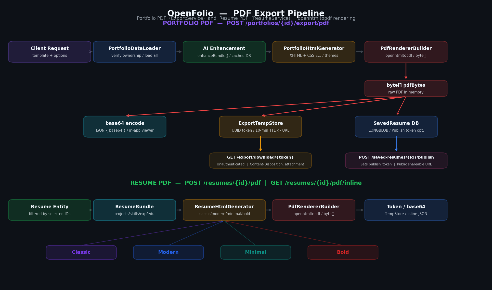

### Portfolio PDF Export

```
POST /portfolios/{id}/export/pdf
        │
        ▼
ExportService.generatePdf(portfolioId, userId, template, options)
        │
        ├── PortfolioDataLoader.load()  → PortfolioBundle (all data)
        │
        ├── [if aiRewrite=true] enhanceBundle()
        │     ├── enhanceProjectDescriptions() (parallel, DB-cached)
        │     └── enhanceSummary() (DB-cached)
        │
        ├── PortfolioHtmlGenerator.generateForPdf(bundle, themeKey, options)
        │     └── XHTML 1.0 Strict document with inline CSS
        │
        ├── PdfRendererBuilder (openhtmltopdf 1.0.10)
        │     └── Renders XHTML → PDF bytes
        │
        ├── ExportTempStore.store(pdfBytes)
        │     └── In-memory map {UUID token → bytes} (10-min TTL)
        │
        └── Returns: { token, downloadUrl }

GET /export/download/{token}   (unauthenticated)
        │
        └── ExportTempStore.retrieve(token) → PDF bytes
            Content-Disposition: attachment; filename="resume.pdf"
```

### Saved Resume Flow

```
POST /portfolios/{id}/export/save
        │
        ├── generatePdfBytes() → byte[]
        ├── new SavedResume(userId, portfolioId, title, template, pdfData)
        └── savedResumeRepository.save()

POST /saved-resumes/{id}/publish
        │
        ├── Generate UUID token (32 hex chars, no dashes)
        └── Returns publicUrl: {baseUrl}/api/v1/public/resume/{token}

GET /public/resume/{token}    (unauthenticated)
        │
        └── Returns PDF with Content-Disposition: inline
```

### HTML Template System

**Portfolio themes** (used for both live preview and PDF):

| Theme | Description |
|---|---|
| `light` | Clean white background, blue accents |
| `dark` | Dark background, purple/blue accents |
| `minimal` | Minimal typography-focused layout |
| `hacker` | Terminal-inspired green-on-black aesthetic |

**Resume builder templates** (ResumeHtmlGenerator):

| Template | Description |
|---|---|
| `classic` | Traditional two-column resume format |
| `modern` | Contemporary design with colored header |
| `minimal` | Clean single-column with whitespace |
| `bold` | High-contrast with strong typography |

The `ExportOptions` record carries rendering flags through the pipeline:

```java
record ExportOptions(
    boolean aiRewriteDescriptions,
    boolean includePhoto, String photoUrl,
    boolean includePhone, String phone,
    boolean includeLinkedIn, String linkedIn,
    boolean includeWebsite, String website
)
```

---

## 9. Portfolio & Resume Lifecycle

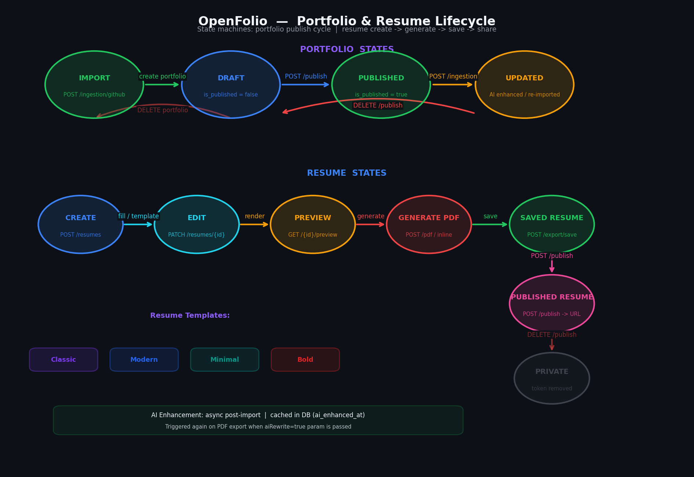

### Portfolio States

```
CREATED ──── edit content ────► DRAFT
    │
    │  POST /portfolios/{id}/publish
    ▼
PUBLISHED ───► public URL active: {baseUrl}/public/{slug}
    │
    │  DELETE /portfolios/{id}/publish
    ▼
UNPUBLISHED (content preserved, URL deactivated)
```

### Saved Resume States

```
GENERATED ──── POST /export/save ────► SAVED (LONGBLOB in DB)
    │
    │  POST /saved-resumes/{id}/publish
    ▼
PUBLISHED ───► public URL: {baseUrl}/api/v1/public/resume/{token}
    │
    │  DELETE /saved-resumes/{id}/publish
    ▼
PRIVATE (PDF preserved, public link removed)
    │
    │  DELETE /saved-resumes/{id}
    ▼
DELETED
```

### Section Display Order

Portfolio sections have a `display_order` integer field. The mobile editor supports drag-and-drop reordering via `react-native-draggable-flatlist`, which calls:

```
PUT /portfolios/{id}/sections/reorder
Body: { "sectionIds": [3, 1, 5, 2, 4, 6] }
```

Default section creation on ingestion:

```
1. About         (display_order: 0)
2. Projects      (display_order: 1)
3. Skills        (display_order: 2)
4. Experience    (display_order: 3)
5. Education     (display_order: 4)
6. Contact       (display_order: 5)
```

---

## 10. Mobile App — React Native

### 10.1 Screen Navigation

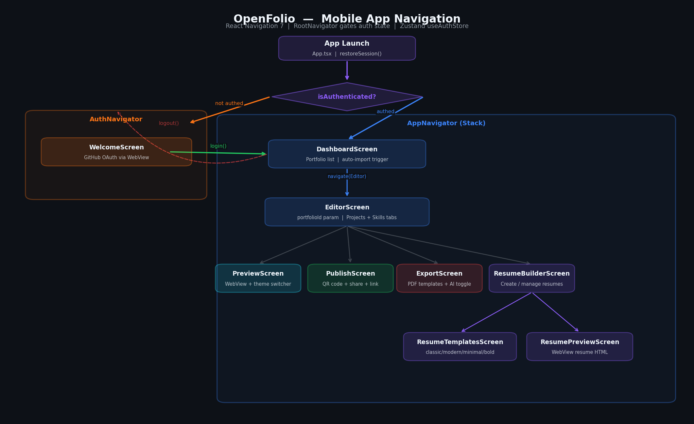

The navigation tree is gated by authentication state via `RootNavigator`:

```
RootNavigator
├── isAuthenticated = false
│   └── AuthNavigator
│       └── WelcomeScreen
│           ├── "Sign in with GitHub" → WebView OAuth flow
│           └── "Sign in with LinkedIn" → WebView OAuth flow
│
└── isAuthenticated = true
    └── AppNavigator (Stack)
        ├── DashboardScreen         (portfolio list, import trigger)
        ├── EditorScreen            (projects/skills editor)
        │   ├── ProjectsTab         (add/edit/delete projects)
        │   └── SkillsTab           (add/edit/delete skills)
        ├── PreviewScreen           (WebView of live portfolio)
        ├── PublishScreen           (publish toggle, QR code, share)
        ├── ExportScreen            (template picker, AI toggle, PDF export)
        │   └── SavedResumesSheet   (list of saved PDFs)
        ├── ResumeBuilderScreen     (list of resumes)
        ├── ResumeEditorScreen      (experience/education/certifications)
        ├── ResumeTemplatesScreen   (template gallery)
        └── ResumePreviewScreen     (WebView of resume PDF)
```

### 10.2 State Management

The app uses **Zustand 5** for global state. Each store is a standalone module with no Redux-style boilerplate.

#### `useAuthStore`

```typescript
interface AuthStore {
  isAuthenticated: boolean;
  isRestoring: boolean;          // true during app launch token check
  userId: number | null;
  email: string | null;
  displayName: string | null;
  githubUsername: string | null;

  restoreSession(): Promise<void>;  // validates token via GET /users/me
  login(tokens, user): void;
  logout(): Promise<void>;
}
```

On app launch, `restoreSession()` reads the access token from Keychain, calls `GET /users/me`, and populates the store. If the call fails (expired token), the app shows the auth screen.

#### `usePortfolioStore`

```typescript
interface PortfolioStore {
  portfolios: Portfolio[];
  currentPortfolio: Portfolio | null;
  isLoading: boolean;

  loadPortfolios(): Promise<void>;
  triggerGitHubImport(): Promise<void>;
  updatePortfolio(id, data): Promise<void>;
  // ... project/skill/section CRUD actions
}
```

### 10.3 API Client & Token Refresh

`apiClient.ts` is an Axios instance with two interceptors:

**Request interceptor:**
```typescript
// Attach Bearer token from Keychain to every request
config.headers.Authorization = `Bearer ${token}`;
```

**Response interceptor (401 handler):**
```typescript
// 1. On 401: pause the failed request
// 2. If not already refreshing:
//    POST /auth/refresh → new access token
//    Save new token to Keychain
//    Retry all pending requests with new token
// 3. If already refreshing: queue request in pendingQueue[]
//    → resolved/rejected when refresh completes
// 4. On refresh failure: logout user
```

This pattern ensures that even if multiple requests fire simultaneously and all receive 401, only one refresh call is made. All concurrent requests are queued and replayed after the single refresh succeeds.

### 10.4 Theme System

The theme system provides `light`, `dark`, and `hacker` themes via React Context.

```typescript
interface AppTheme {
  colors: {
    background: string;
    surface: string;
    primary: string;
    text: string;
    textSecondary: string;
    border: string;
    success: string;
    error: string;
    // ...
  };
  spacing: Record<'xs'|'sm'|'md'|'lg'|'xl'|'2xl', number>;
  radius: Record<'sm'|'md'|'lg'|'full', number>;
  fonts: { sizes: Record<string, number>; weights: Record<string, string> };
}
```

**Theme variants:**

| Theme | Background | Primary accent | Use case |
|---|---|---|---|
| `light` | `#FFFFFF` | `#6366F1` (indigo) | Default, clean |
| `dark` | `#0D1117` | `#8B5CF6` (purple) | OLED-friendly |
| `hacker` | `#000000` | `#00FF41` (matrix green) | Terminal aesthetic |

Components consume the theme via `useTheme()` hook. The preview screen applies the same theme key to the portfolio HTML so the in-app preview exactly matches the exported PDF.

---

## 11. Public Portfolio Publishing

When a portfolio is published, it gets a unique URL slug. The public page is served by `PublicPortfolioController` — an unauthenticated endpoint that renders the full portfolio HTML using the same `PortfolioHtmlGenerator`.

```
POST /api/v1/portfolios/{id}/publish
        │
        ├── Generate slug from displayName (e.g., "john-doe-a1b2")
        ├── Create PublishRecord { portfolioId, slug, publishedAt }
        └── Portfolio.isPublished = true

GET /api/v1/public/{slug}
        │
        ├── Load portfolio by slug (PublishRecord → Portfolio)
        ├── PortfolioHtmlGenerator.generate(bundle, theme)
        └── Return full HTML page (Content-Type: text/html)

GET /api/v1/public/{slug}/meta
        │
        └── Return { title, tagline, avatarUrl, slug }
            (Used for Open Graph / social preview cards)
```

The `PreviewScreen` in the mobile app renders the public URL in a `WebView`. The `PublishScreen` generates a QR code pointing to the public URL using `react-native-qrcode-svg`, which can be shared via the native share sheet.

---

## 12. Developer Setup

### 12.1 Backend

**Prerequisites:**
- Java 21+
- Maven 3.8+
- MySQL 8.x running locally

**Steps:**

```bash
# 1. Clone and navigate to backend
cd backend

# 2. Create database
mysql -u root -p -e "CREATE DATABASE openfolio CHARACTER SET utf8mb4 COLLATE utf8mb4_unicode_ci;"

# 3. Set environment variables (see §13)
export JWT_SECRET="your-256-bit-secret-here"
export SPRING_DATASOURCE_URL="jdbc:mysql://localhost:3306/openfolio"
export SPRING_DATASOURCE_USERNAME="root"
export SPRING_DATASOURCE_PASSWORD="yourpassword"
export GITHUB_CLIENT_ID="your_github_client_id"
export GITHUB_CLIENT_SECRET="your_github_client_secret"

# 4. Run — Flyway migrations run automatically on startup
./mvnw spring-boot:run
```

The API starts on `http://localhost:8080`. Health check: `GET /actuator/health`.

**Dev profile:** The `dev` profile uses relaxed CORS (`http://localhost:3000` allowed by default). Set `CORS_ALLOWED_ORIGINS` to include your mobile dev server if needed.

### 12.2 Mobile

**Prerequisites:**
- Node.js 20+
- React Native dev environment (Xcode / Android Studio)
- iOS: CocoaPods

```bash
# 1. Navigate to mobile
cd mobile

# 2. Install dependencies
npm install

# 3. iOS pods
cd ios && pod install && cd ..

# 4. Configure API base URL
# Edit src/api/apiClient.ts — set baseURL to your backend host
# For local dev: http://localhost:8080/api/v1

# 5. Run
npm run ios
# or
npm run android
```

**Environment variables** in mobile are handled via `react-native-dotenv`. Create a `.env` file at `mobile/.env`:

```
API_BASE_URL=http://localhost:8080/api/v1
GITHUB_CLIENT_ID=your_github_client_id
```

### 12.3 Ollama AI (Local)

```bash
# Install Ollama (macOS)
curl -fsSL https://ollama.com/install.sh | sh

# Pull the model (one-time, ~9GB)
ollama pull qwen2.5:14b

# Verify it's running
ollama serve
curl http://localhost:11434/api/tags
```

The backend connects to `http://localhost:11434` by default. If Ollama is on a different host, set `OLLAMA_BASE_URL` in the backend environment.

**Performance notes:**
- First generation: ~30-60s (model cold start)
- Subsequent: ~5-15s per project description
- 6-thread pool means 6 descriptions generate simultaneously
- Results cached permanently in DB — re-import reuses cached descriptions

### Regenerating Architecture Diagrams

```bash
# Uses the project venv (matplotlib + numpy already installed)
/Users/borismilev/Desktop/OpenFolio/venv/bin/python \
    /Users/borismilev/Desktop/OpenFolio/diagrams/generate_diagrams.py
```

---

## 13. Environment Variables

### Backend

| Variable | Required | Default | Description |
|---|---|---|---|
| `JWT_SECRET` | Yes | — | HMAC-SHA secret (min 256 bits) |
| `SPRING_PROFILES_ACTIVE` | No | `dev` | `dev` or `prod` |
| `SPRING_DATASOURCE_URL` | Yes | — | `jdbc:mysql://host:3306/openfolio` |
| `SPRING_DATASOURCE_USERNAME` | Yes | — | MySQL username |
| `SPRING_DATASOURCE_PASSWORD` | Yes | — | MySQL password |
| `GITHUB_CLIENT_ID` | Yes | — | GitHub OAuth app client ID |
| `GITHUB_CLIENT_SECRET` | Yes | — | GitHub OAuth app client secret |
| `GITHUB_TOKEN` | No | — | Personal access token (higher API rate limits) |
| `LINKEDIN_CLIENT_ID` | No | — | LinkedIn OAuth app client ID |
| `LINKEDIN_CLIENT_SECRET` | No | — | LinkedIn OAuth app client secret |
| `CORS_ALLOWED_ORIGINS` | No | `http://localhost:3000` | Comma-separated allowed origins |
| `APP_BASE_URL` | No | `http://localhost:8080` | Base URL for generated download links |

### JWT Token Expiry (hardcoded in `application.yml`)

| Token | Expiry |
|---|---|
| Access token | 15 minutes (900,000 ms) |
| Refresh token | 30 days (2,592,000,000 ms) |

---

## 14. Diagram Gallery

All diagrams are generated from source by `/diagrams/generate_diagrams.py` using only `matplotlib` and `numpy` (pre-installed in the project venv).

### System Architecture (C4)


### Entity Relationship Diagram


### Backend Layer Architecture


### REST API Endpoints Reference


### Mobile Navigation Flow


### OAuth + JWT Authentication Flow


### GitHub Ingestion Pipeline


### PDF Export Pipeline


### Portfolio & Resume Lifecycle


### Technology Stack Overview


---

*Generated diagrams source: `diagrams/generate_diagrams.py` · Run with: `venv/bin/python diagrams/generate_diagrams.py`*
